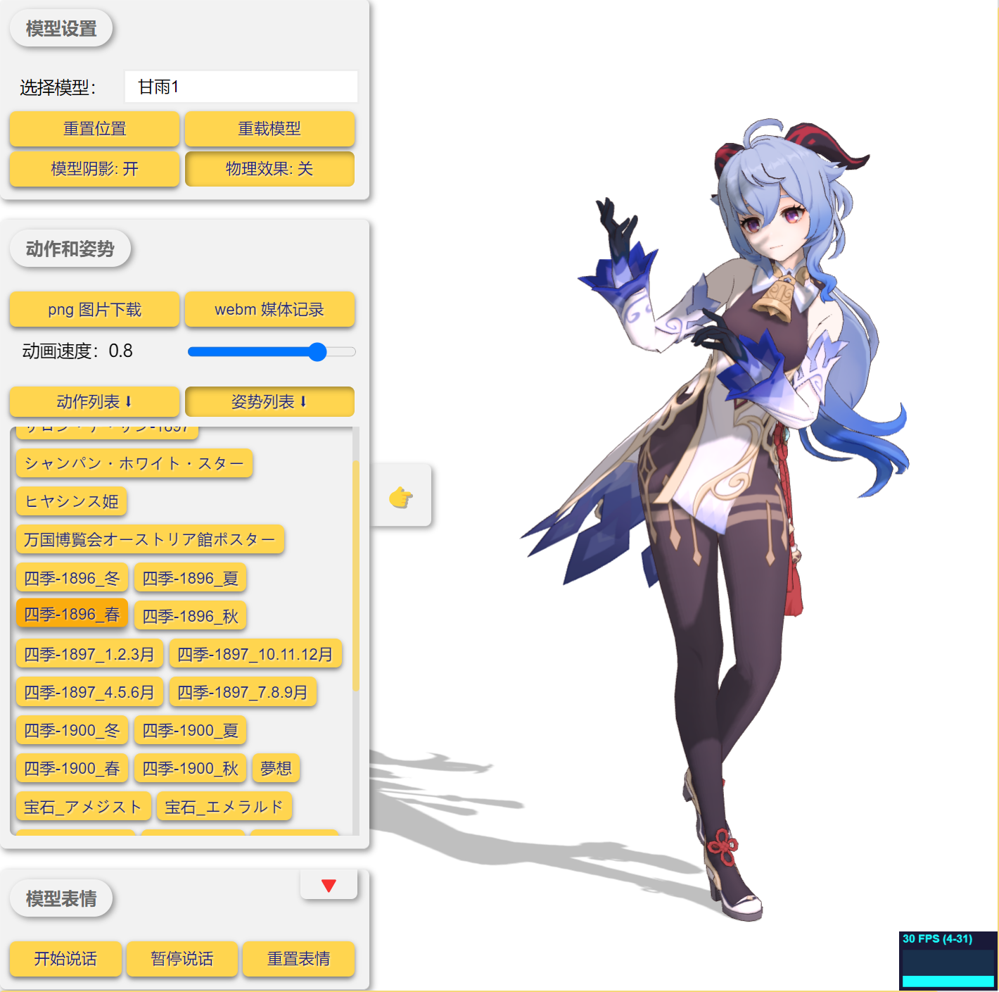
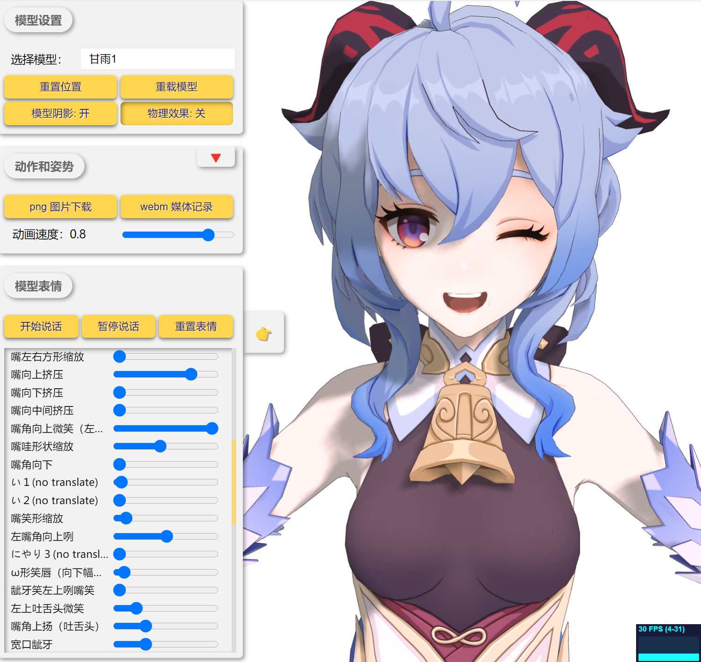

# PMX on Web

本项目是一个基于 WebGL 的 PMX 渲染器，可以在浏览器中加载 PMX 模型并进行渲染。

> 本项目模型来自 [原神官方提供的素材](https://www.aplaybox.com/u/680828836/model)，使用时请遵守其相关协议。

### TODO

- [x] 音频转表情的算法（需持续优化...）

- [x] 说话测试时的音频 demo 更换

- [ ] new branch: 在网页底部可以拖起一个对话框，用于和模型对话
    + 对话基于 openai api 获取回复文本
    + 文本基于 VITS 训练特定模型人物的音频
    + 加载音频并自动播放

### 模型动作

### 模型姿势

### 模型表情

